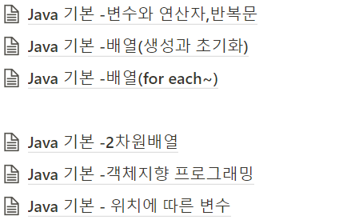

# RyeoRyeo's ressafy

I'll do review on this repository

## Getting Started

I'm in ssafy 8th! I'll do my best for this my last chance!!!

## Java basic

We started Java basic check my [notion](https://ryeo.notion.site/Java-basic-71796d51b81446acabffe92385eae957)!<br>
<br>


### Installing

Someday I'll comment about it

```
Give the example
```

And repeat

```
until finished
```

End with an example of getting some data out of the system or using it for a little demo

## Running the tests

Explain how to run the automated tests for this system

### Break down into end to end tests

Explain what these tests test and why

```
Give an example
```

### And coding style tests

Explain what these tests test and why

```
Give an example
```

## Deployment

Add additional notes about how to deploy this on a live system

## Built With

* [Dropwizard](http://www.dropwizard.io/1.0.2/docs/) - The web framework used
* [Maven](https://maven.apache.org/) - Dependency Management
* [ROME](https://rometools.github.io/rome/) - Used to generate RSS Feeds

## Contributing

Please read [CONTRIBUTING.md](https://gist.github.com/PurpleBooth/b24679402957c63ec426) for details on our code of conduct, and the process for submitting pull requests to us.

## Versioning

We use [SemVer](http://semver.org/) for versioning. For the versions available, see the [tags on this repository](https://github.com/your/project/tags). 

## Authors

* **Billie Thompson** - *Initial work* - [PurpleBooth](https://github.com/PurpleBooth)

See also the list of [contributors](https://github.com/your/project/contributors) who participated in this project.

## License

This project is licensed under the MIT License - see the [LICENSE.md](LICENSE.md) file for details

## Acknowledgments

* Hat tip to anyone whose code was used
* Inspiration
* etc

<style type="text/css">
.tg  {border-collapse:collapse;border-spacing:0;}
.tg td{border-color:black;border-style:solid;border-width:1px;font-family:Arial, sans-serif;font-size:14px;
  overflow:hidden;padding:10px 5px;word-break:normal;}
.tg th{border-color:black;border-style:solid;border-width:1px;font-family:Arial, sans-serif;font-size:14px;
  font-weight:normal;overflow:hidden;padding:10px 5px;word-break:normal;}
.tg .tg-c3ow{border-color:inherit;text-align:center;vertical-align:top}
</style>
<table class="tg">
<thead>
  <tr>
    <th class="tg-c3ow">순번</th>
    <th class="tg-c3ow">요구사항명</th>
    <th class="tg-c3ow">요구사항 상세</th>
  </tr>
</thead>
<tbody>
  <tr>
    <td class="tg-c3ow" colspan="3">기능적 요구사항</td>
  </tr>
  <tr>
    <td class="tg-c3ow">F01</td>
    <td class="tg-c3ow">따릉이 대여소 정보 수집</td>
    <td class="tg-c3ow">공공데이터 포털: 따릉이 데이터 가공 후 DB저장</td>
  </tr>
  <tr>
    <td class="tg-c3ow">F02</td>
    <td class="tg-c3ow">공원 정보 수집</td>
    <td class="tg-c3ow">공공데이터 포털: 
서울시 주요 공원현황 데이터 가공 후 DB저장</td>
  </tr>
  <tr>
    <td class="tg-c3ow">F03</td>
    <td class="tg-c3ow">맛집 정보 수집</td>
    <td class="tg-c3ow">공공데이터 포털: 서울시 관광 맛집 데이터 가공 후 DB저장</td>
  </tr>
  <tr>
    <td class="tg-c3ow">F04</td>
    <td class="tg-c3ow">관광 명소 정보 수집</td>
    <td class="tg-c3ow">공공데이터 포털: 서울시 관광 명소 데이터 가공 후 DB저장</td>
  </tr>
  <tr>
    <td class="tg-c3ow">F05</td>
    <td class="tg-c3ow">대여소 검색</td>
    <td class="tg-c3ow">구/동별 따릉이 대여소 검색 결과 데이터 제공</td>
  </tr>
  <tr>
    <td class="tg-c3ow">F06</td>
    <td class="tg-c3ow">관심 지역 상세</td>
    <td class="tg-c3ow">지도에 표시된 마커로 관련 정보 조회 및 관심지역 추가기능</td>
  </tr>
  <tr>
    <td class="tg-c3ow">F07</td>
    <td class="tg-c3ow">게시판 글 추가/수정/삭제</td>
    <td class="tg-c3ow">게시판 글쓰기 및 수정, 삭제와 첨부파일 업로드</td>
  </tr>
  <tr>
    <td class="tg-c3ow">F08</td>
    <td class="tg-c3ow">게시판 글 좋아요 기능</td>
    <td class="tg-c3ow">회원의 게시글 좋아요 DB 적용</td>
  </tr>
  <tr>
    <td class="tg-c3ow">F09</td>
    <td class="tg-c3ow"></td>
    <td class="tg-c3ow"></td>
  </tr>
  <tr>
    <td class="tg-c3ow"></td>
    <td class="tg-c3ow"></td>
    <td class="tg-c3ow"></td>
  </tr>
  <tr>
    <td class="tg-c3ow" colspan="3">비기능적 요구사항</td>
  </tr>
  <tr>
    <td class="tg-c3ow">NF01</td>
    <td class="tg-c3ow"></td>
    <td class="tg-c3ow"></td>
  </tr>
</tbody>
</table>
