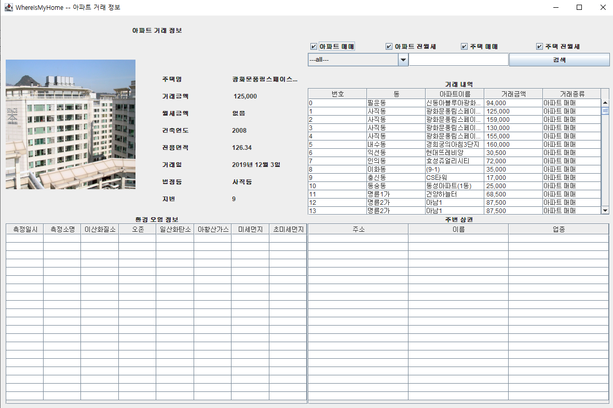
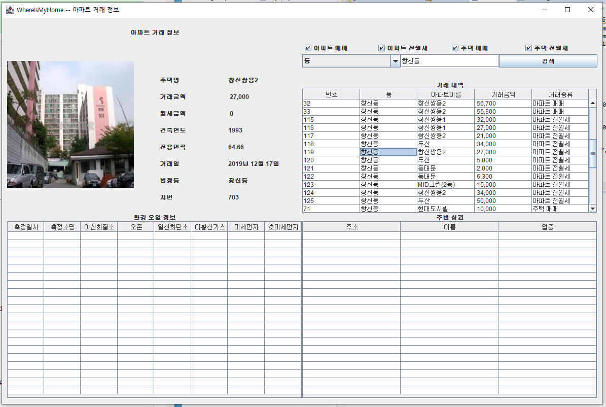
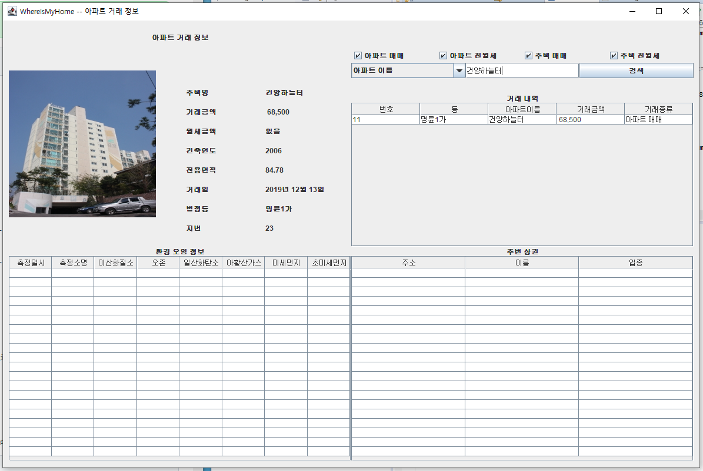
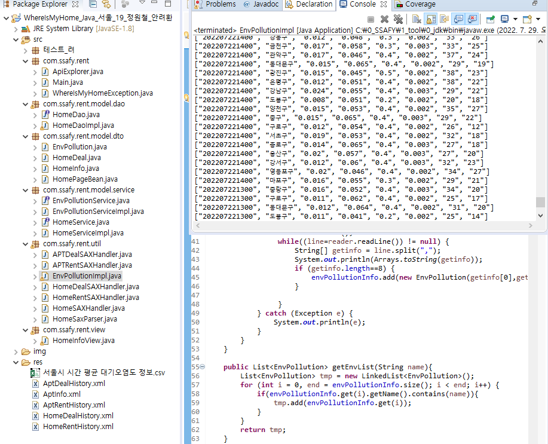

# Member

pair7 안려환 정원철

## Requirements

- 관통 프로젝트
- 자바
- 해피하우스

## Application Structure

- `View`: UI 역할
- `Service`: 비즈니스 로직 구현
- `Dao`: 데이터베이스 접근, 도메인 객체를 DB에 저장하고 관리
- `Dto`: 비즈니스 도메인 객체

## 결과화면
### 아무런 조건도 주지 않았을 경우

### 동으로 조회한 경우

### 아파트 이름으로 조회한 경우

### [추가 기능] 대기 환경 정보 출력

 
원하는 주택이나 아파트를 선택하게되면 해당 구를 기반으로 대기현황이 테이블 형태로 출력

### [심화 기능] 상권 정보 출력

 
기능 구현에 실패하여 csv 파일 파싱까지 한 부분 업로드 하였습니다.

## 제출 소스
| ClassName  code line No. | code                                                         |
| ------------------------ | :----------------------------------------------------------- |
| HouseInfoView 246~247    |  |
| HouseServiceImpl 34      |  |
| HouseDaoImpl  80         |  HouseInfo에 저장된 이미지 소스를 HouseDeal 인스턴스의 멤버 변수에 세팅 |
| APTRentSAXHandler 28~    |  |
| HouseDealSAXHandler      |  |

## 추가 기능 추가한 파일
- EnvPollution.java
- EnvPollutionService.java
- EnvPollutionServiceImpl.java
- EnvPollutionImpl.java
- 서울시 시간 평균 대기오염도 정보.csv

## 심화 기능 추가한 파일
- ConvenientCSVparser.java
- Convenient.java
- convenient.csv